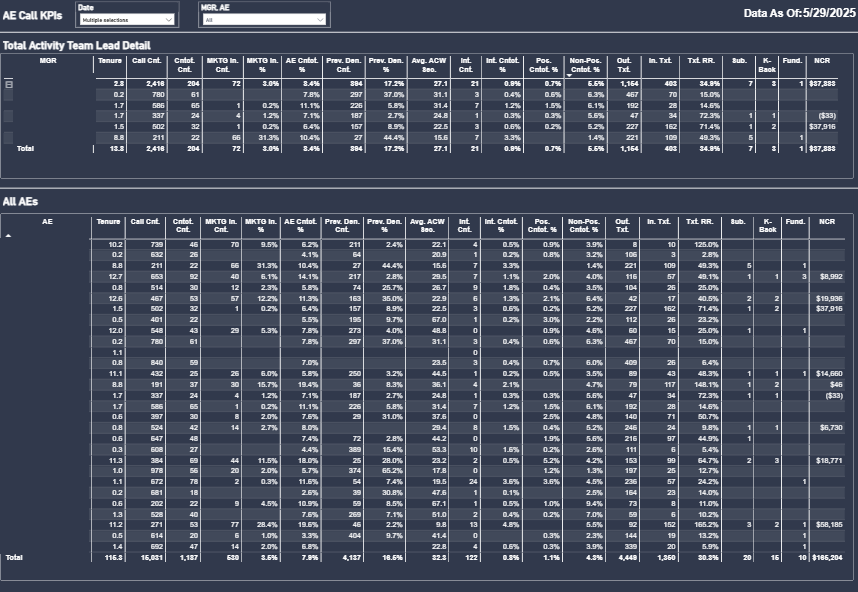
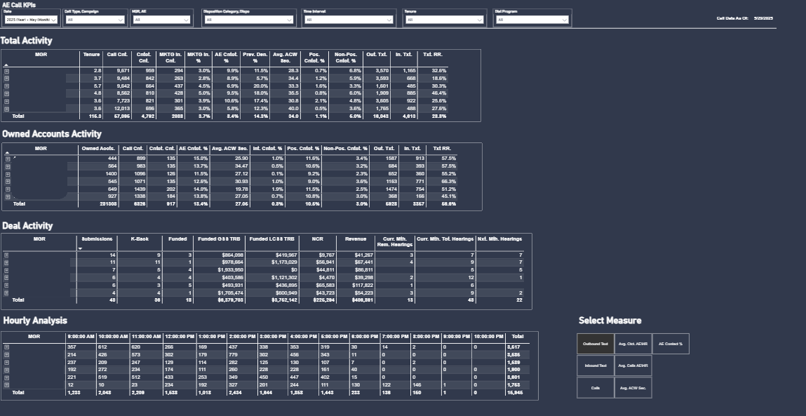

# Contact Center Analytics Suite

## 🎯 Executive Summary

Enterprise grade Call Center KPI, deal flow, and hourly analysis executive dashboard.

## 📊 Business Impact

- **Real-time visibility** into agent performance across Manager-to-Account Executive hierarchies
- **Automated quality management** with disposition tracking and text messaging effectiveness analysis
- **Strategic decision-making** enabled through 100+ custom DAX calculations

## 🏗️ Technical Architecture

### Data Integration Pipeline
```
Five9 Call Center ──┐
                   ├─► Power BI Analytics Platform ──► Executive Dashboards
Salesforce CRM ────┘
```

### Key Data Sources
- **Five9 Call Center:** Call activity, dispositions, after-call work metrics
- **Salesforce CRM:** Account data, contact records, text messaging analytics
- **SharePoint:** Employee hierarchy and tenure data

## 📈 Dashboard Components

### 1. Call and Texting Measures
**Matrix Structure:** Manager to Account Executive hierarchy display
**Data Sources:** Five9 call center data, Salesforce CRM, SharePoint employee hierarchy

**Core Metrics:**
1. **Tenure** - Employee tenure data from SharePoint hierarchy
2. **Total Call Counts** - Complete call volume from Five9 call center data
3. **Contact Counts** - Calls where disposition = "contact" (Five9 source)
4. **Marketing Inbound Calls** - Inbound calls taken from Five9
5. **Inbound Call Percentage** - Percentage of inbound calls to total call count
6. **AE Contact Rate** - Contact calls as percentage of total call count
7. **Preview Denial Rate** - Preview dialer calls passed on as percentage of total preview volume
8. **Average After Call Work Seconds** - Average seconds for after call work (high values indicate slow call taking)
9. **Positive Contact %** - Contacted dispositions where customer may be interested
10. **Non-Positive Contact %** - Contacted dispositions where customer is not interested
11. **Outbound Text Counts** - Outbound text message volume (Salesforce source)
12. **Inbound Text Counts** - Inbound text message volume (Salesforce source)
13. **Text Response Rate** - Inbound Texts ÷ Outbound Texts (messaging efficacy measurement)

### 2. Owned Accounts Activity
**Business Philosophy:** *"A time of need is a lead."*
**Matrix Structure:** Manager to Account Executive hierarchy display

**Core Metrics:**
1. **Owned Accounts** - Accounts owned by an Account Executive (Salesforce source)
2. **Call Count** - Call counts to owned accounts (Five9 source)
3. **Contact Counts** - Calls where disposition = "contact" and account is owned (Five9 source)
4. **AE Contact Rate** - Contact percentage of total call count for owned accounts
5. **Interested Contact %** - Contacted interested disposition ÷ total call count
6. **Positive Contact %** - All contacted interested dispositions ÷ contacted dispositions
7. **Non-Positive Contact %** - All contacted not interested dispositions ÷ contacted dispositions
8. **Outbound Text** - Outbound text counts for owned accounts (Salesforce source)
9. **Inbound Text Counts** - Inbound text counts for owned accounts (Salesforce source)
10. **Text Response Rate** - Inbound Texts ÷ Outbound Texts for owned accounts (messaging efficacy)

### 3. Deal Activity Pipeline
**Purpose:** Pipeline tracking showing count of Submitted, Contracts Back, and Funded deal pipeline
**Matrix Structure:** Manager to Account Executive hierarchy display

**Pipeline Metrics:**
1. **Submissions** - Submitted deals (Salesforce source)
2. **Contracts Back** - Contracts signed and received (Salesforce source)  
3. **Funded** - Deals funded (Salesforce source)
4. **Funded GSS** - Payments purchased for Guaranteed Structured Settlements (Salesforce source)
5. **Funded LCSS** - Payments purchased for Life Contingent Structured Settlements (Salesforce source)
6. **Net Commissionable Revenue** - Net Revenue Eligible for Commission (Salesforce source)
7. **Revenue** - Gross Revenue after payments have been sold (Salesforce source)
8. **Current Month Remaining Hearings** - Court hearings remaining this month where structured settlement payments sold need court approval (Salesforce source)
9. **Total Month Hearings** - Total court hearings this month where structured settlement payments sold need court approval (Salesforce source)
10. **Next Month Hearings** - Court hearings scheduled next month (Salesforce source)

### 4. Hourly Analysis
**Purpose:** Various metrics displayed in one-hour blocks during business hours for tactical optimization
**Matrix Structure:** Manager to Account Executive hierarchy display

**Hourly Performance Metrics:**
1. **Outbound Text** - Outbound text messages (Salesforce source)
2. **Inbound Text** - Inbound text messages (Salesforce source)
3. **Call Counts** - Total call count (Five9 source)
4. **Average Contact Rate Per Hour Per AE** - Contacted Dispositions ÷ All Calls (Five9 source)
5. **Average Calls Per Hour Per AE** - Calls per Account Executive (Five9 source)
6. **Average After Call Work Seconds** - After Call Work status ÷ Call Count (Five9 source)
7. **Contact %** - Contacted Dispositions ÷ All Calls (Five9 source)

**Business Value:** Enables tactical adjustments to outbound omni-channel strategies through hour-by-hour performance analysis

## 🔧 Technical Implementation

### Advanced DAX Calculations (100+ Measures)

**Sample Key Measures:**

```dax
// Contact Rate Calculation
Contact Rate = 
DIVIDE(
    COUNTROWS(FILTER(Tasks, Tasks[CallDisposition] = "Contact")),
    COUNTROWS(Tasks),
    0
)

// Text Response Rate
Text Response Rate = 
DIVIDE(
    SUM(TextMessages[InboundCount]),
    SUM(TextMessages[OutboundCount]),
    0
)

// Average After Call Work (Seconds)
Avg After Call Work = 
AVERAGE(Tasks[AfterCallWorkSeconds])

// Positive Contact Percentage
Positive Contact % = 
DIVIDE(
    COUNTROWS(FILTER(Tasks, 
        Tasks[CallDisposition] IN {"Interested", "Callback Scheduled", "Information Sent"}
    )),
    COUNTROWS(FILTER(Tasks, Tasks[CallDisposition] = "Contact")),
    0
)

// Preview Denial Rate
Preview Denial Rate = 
DIVIDE(
    COUNTROWS(FILTER(Tasks, Tasks[CallType] = "Preview" && Tasks[Disposition] = "Denied")),
    COUNTROWS(FILTER(Tasks, Tasks[CallType] = "Preview")),
    0
)
```

### Data Model Architecture

**Fact Tables:**
- `Tasks` (Call activities and dispositions)
- `TextMessages` (Inbound/outbound messaging data)
- `Deals` (Pipeline and revenue data)

**Dimension Tables:**
- `Employees` (Manager-to-AE hierarchy from SharePoint)
- `Accounts` (Salesforce account data)
- `Calendar` (Time intelligence for hourly analysis)
- `Dispositions` (Call outcome categorization)

**Relationships:**
- Star schema design for optimal performance
- Bi-directional filtering where appropriate
- Role-playing dimensions for temporal analysis

## 📊 Visual Design & User Experience

### Executive Dashboard Layout
**Top-Level KPIs:**
- Contact Rate trending with 36% improvement highlight
- Call volume metrics with variance analysis
- Text messaging effectiveness scores
- Revenue pipeline health indicators

**Interactive Features:**
- Manager-to-AE hierarchy drill-down
- Time period selection (daily, weekly, monthly, quarterly)
- Geographic filtering capabilities
- Performance benchmark comparisons

### Operational Dashboard Components
**Real-Time Monitoring:**
- Live call activity tracking
- Current hour performance metrics
- After-call work efficiency monitoring
- Queue management and preview denial rates

**Historical Analysis:**
- Trend analysis with seasonal adjustments
- Year-over-year performance comparisons
- Agent development tracking
- Best practice identification


## 📊 Dashboard Screenshots

### Manager-Level Performance Overview

*Executive dashboard showing Manager-to-AE performance matrix with contact rates, deal pipeline, and team metrics*

### Account Executive Deal Pipeline

*Detailed AE-level view featuring deal pipeline tracking, revenue metrics, and individual performance indicators*

**Key Features Demonstrated:**
- Manager-to-AE hierarchy drill-down capability
- Real-time contact rate tracking (36% improvement)
- Deal pipeline progression (Submissions → Contracts → Funded)
- Court hearing management and scheduling
- Revenue analytics (NCR, GSS, LCSS tracking)


## 🎯 Business Value Delivered

### Operational Improvements
- **Contact Rate Optimization:** 36% improvement through data-driven insights
- **Resource Allocation:** Optimal scheduling based on hourly performance analysis
- **Quality Management:** Systematic tracking of disposition accuracy and efficiency
- **Strategic Planning:** Pipeline visibility enabling proactive business decisions

### Decision-Making Enhancement
- **Real-Time Adjustments:** Hour-by-hour performance enables tactical modifications
- **Performance Management:** Manager-to-AE visibility supports coaching and development
- **Channel Optimization:** Text vs. call effectiveness analysis guides communication strategy
- **Revenue Forecasting:** Pipeline analytics support accurate business planning

### Cost Optimization
- **Efficiency Gains:** After-call work analysis identifies process improvements
- **Preview Optimization:** Denial rate tracking reduces wasted dialer time
- **Resource Planning:** Performance patterns guide staffing decisions
- **Technology ROI:** Five9 and Salesforce integration value quantification

## 🔍 Advanced Analytics Features

### Statistical Analysis
- **Performance Trending:** Statistical significance testing for improvement validation
- **Correlation Analysis:** Identifying relationships between metrics and outcomes
- **Outlier Detection:** Automated identification of unusual performance patterns
- **Predictive Indicators:** Leading metrics for performance forecasting

### Machine Learning Integration Opportunities
- **Contact Probability Scoring:** Predictive models for call success likelihood
- **Optimal Timing Models:** Best time to contact individual prospects
- **Channel Preference Prediction:** Automated communication method selection
- **Performance Forecasting:** Agent performance trajectory modeling

## 📋 Future Enhancement Roadmap

### Phase 1: Advanced Analytics
- Predictive contact scoring models
- Automated performance alerting
- Advanced geographic segmentation
- Customer journey analytics

### Phase 2: AI Integration
- Natural language processing for call sentiment
- Automated coaching recommendations
- Dynamic territory optimization
- Real-time performance optimization

### Phase 3: Enterprise Expansion
- Multi-location performance comparison
- Cross-departmental analytics integration
- Advanced revenue attribution modeling
- Executive mobile dashboard deployment


---

*This Contact Center Analytics Suite demonstrates advanced Power BI development capabilities, sophisticated DAX programming, and the ability to deliver measurable business impact through strategic business intelligence solutions.*
